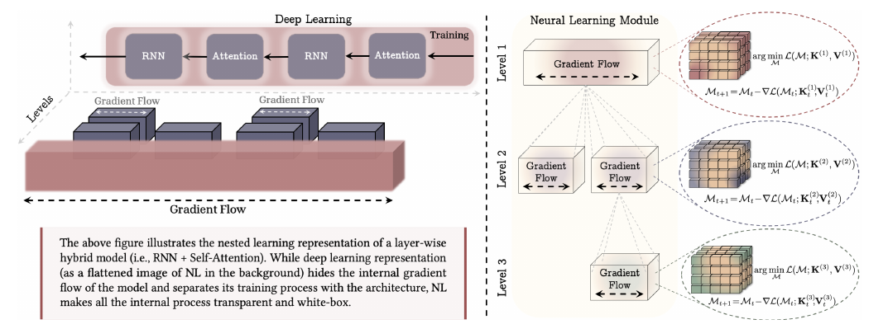
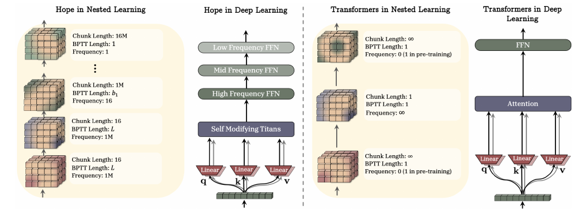

</img>
</img>

## Nested Learning - PyTorch

Unofficial implementation of Google's [Nested Learning](https://abehrouz.github.io/files/NL.pdf) in Pytorch.

Nested learning is a learning framework that leverage multiple hierarchical levels to gain better expressive power in
representing complex features. Gradient flows are represented transparently across different levels, each level has it's own context, and thus levels can have have their own update frequencies, unleashing the power of meta-learning and online learning. It is not only essentially a continuous learning system capable of effectively compressing and forgetting based on surprises in the latent space, but also has a uniform and reusable structure that is closer to the human brain, thus possessing great potential to become the next generation of biological-like learning systems.

This repository borrows some update processes from lucidrains' excellent [Titans-pytorch project](https://github.com/lucidrains/titans-pytorch), as well as some data structures from kmccleary3301's [nested_learning project](https://github.com/kmccleary3301/nested_learning), and implemented:
1. A fully adaptive Titans level which k, q, v, eta, alpha, and the memory itself are meta-learned across all sequences/context.
2. A hierarchical Hope block, where different blocks (i.e. Titans and FFN) and their inner optimizers are on different levels and have their own gradient flows and contexts. All parameters in blocks are meta-learned and optimized by it's own optizizer in a higher level.
3. A DMGD (Deep Momentum Gradient Descent) optimizer as an independent level which maps gradients to an orthogonal space and manage the momentum in a 'deep' way.
4. A temporal framework for managing gradients in meta-learning, which enables us to process levels at different frequencies and fast training.

## Install

```bash
pip install requirements.txt
```

## Usage

A Hope backbone with multiple Hope blocks optimized by DGD can be used as
```python
python train_hope.py --hope_tiny
```

See `configs/hope_tiny.yaml` for an example slow→mid→fast→Titans stack and how optimizer overrides are attached.

## Citations

```bibtex
@inproceedings{Behrouz2025NestedLearning,
    title   = {Nested Learning: The Illusion of Deep Learning Architecture},
    author  = {Ali Behrouz and Meisam Razaviyayn and Peilin Zhong and Vahab Mirrokni},
    booktitle = {NeurIPS 2025 (Poster)},
    year    = {2025},
    url     = {https://neurips.cc/virtual/2025/loc/san-diego/poster/116123}
}

@inproceedings{Behrouz2024TitansLT,
    title   = {Titans: Learning to Memorize at Test Time},
    author  = {Ali Behrouz and Peilin Zhong and Vahab S. Mirrokni},
    year    = {2024},
    url     = {https://arxiv.org/pdf/2501.00663}
}

@inproceedings{Yang2024GatedDN,
    title   = {Gated Delta Networks: Improving Mamba2 with Delta Rule},
    author  = {Songlin Yang and Jan Kautz and Ali Hatamizadeh},
    year    = {2024},
    url     = {https://arxiv.org/pdf/2504.13173}
}
```

## License

MIT (see `LICENSE`).

